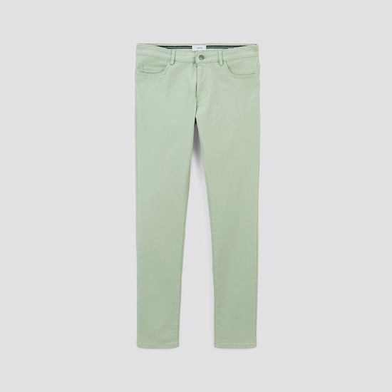
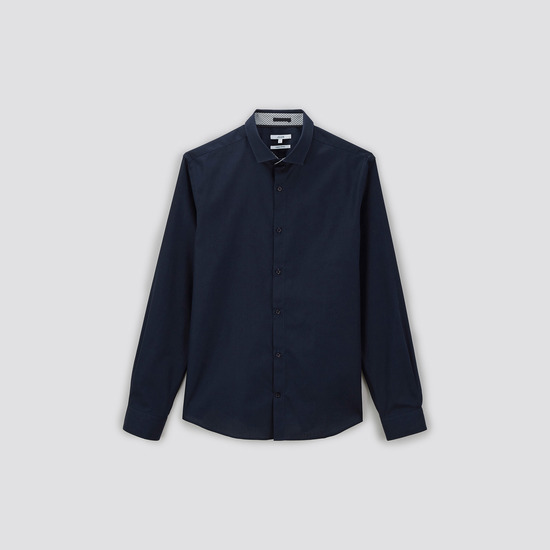
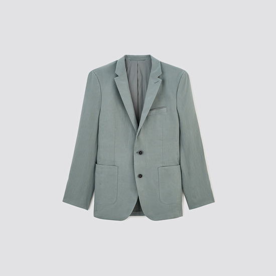

# Flux1-Shnell-LoRA-JLSCOM

This repository is for training the `Flux1.0-Schnell` model using a sample dataset of garments from Jules.com.

This adapted model is licensed under the `AGPL-3.0 License`.  
**Commercial use** of the code, configurations, or model adapters is strictly prohibited without explicit written authorization.

The model weights are hosted on [Hugging Face Hub](https://huggingface.co/) at `Amine-CV/JLSCOM_garment_LoRA_flux_schnell_v1` and are distributed under the `AGPL-3.0 License`.

---

## Inference and Image Generation

To generate images using the model adapters, use the following code and replace `[trigger]` with `JLSCOM`:  

```python
from diffusers import AutoPipelineForText2Image
import torch

pipeline = AutoPipelineForText2Image.from_pretrained(
    'black-forest-labs/FLUX.1-schnell', 
    torch_dtype=torch.bfloat16
).to('cuda')

pipeline.load_lora_weights(
    'Amine-CV/JLSCOM_garment_LoRA_flux_schnell_v1', 
    weight_name='JLSCOM_garment_LoRA_flux_schnell.safetensors'
)

prompt = "[trigger] Garment Type: Slim-Fit Jeans Fit and Style: Slim-fit, designed to hug the legs closely without being overly tight, offering a contemporary, streamlined appearance. ..."
image = pipeline(prompt).images[0]
image.save("my_image.png")
```

### Trigger Word
Use **`JLSCOM`** to activate the image generation style.

---

## Training

This model was trained using the [AI Toolkit by Ostris](https://github.com/ostris/ai-toolkit).  
All training code is included in this repository.

### Cloning the Repository

To clone the repository, use the following command:
```shell
git clone https://github.com/kmamine/Flux1-Shnell-LoRA-JLSCOM.git
```

### Setting Up the Environment

Install the environment using the provided `.yml` file:
```shell
cd ./Flux1-Shnell-LoRA-JLSCOM/
conda env create -f env.yml
```


---

## Dataset Preparation

The training dataset consists of 100 unlabeled garment images from [Jules.com](https://jules.com).

<table>
    <tr>
        <td>  </td>
        <td>  </td>
        <td>  </td>
        <td>  </td>
    </tr>
</table>

### Captioning

Captions were generated using the `OpenAI GPT4-o` model. Below is an example script for generating captions:

```python
import openai

prompt = """
Describe a [garment type] in great detail, incorporating each of the following features where applicable:

Garment Type: Specify the exact type (e.g., T-shirt, jacket).
Fit and Style: Describe the fit and style (e.g., slim-fit, oversized).
Color and Pattern: Mention the color and any specific pattern (e.g., solid black, floral).

Fabric/Material: Specify the material used (e.g., cotton, denim).
Details: Include notable features (e.g., pockets, buttons, logos).
Display Style: Describe how it's displayed (e.g., on model, flat lay).
Background and Lighting: Describe the setting, lighting style, or mood.
Shape: Specify the overall shape (e.g., boxy, fitted, flowy).
Sleeve Style: Mention the sleeve type (e.g., long sleeve, cap sleeve).
Neckline: Describe the neckline (e.g., crew neck, V-neck).
Closures: Specify closure type and placement (e.g., front zipper, side buttons).
Embellishments: Note any decorative details (e.g., embroidery, sequins).
Branding: Include logo placement or brand tags if present.
Patterns/Prints: Mention any additional patterns (e.g., graphic print, color-blocked).
Pockets: Specify the number, style, and placement.
Hood: Indicate if a hood is present and if it's adjustable or detachable.
Cuffs and Hems: Describe the cuff and hem style.
Fit: Provide a sense of fit (e.g., relaxed, tailored).
Length: Mention length (e.g., cropped, longline).
Occasion: Specify the intended use (e.g., casual, formal).
Style Influence: Describe any style influences (e.g., retro, minimalist).
Seasonal Suitability: Indicate if it's suited for a particular season.
Weather Features: Mention any protective or functional weather features.
Background Type: Describe the background setting if relevant.
Lighting: Specify the lighting (e.g., soft, spotlight).
Color Variations: Note any specific color variations or effects.
Texture: Describe the fabric texture (e.g., quilted, ribbed).
Weight: Mention the fabric weight (e.g., light, thick).
Finish: Describe any special finishes (e.g., glossy, distressed).
Layer Style: Describe any layering features (e.g., lined, reversible).
Collar Type: Specify the collar type (e.g., mandarin collar).
Adjustability: Note any adjustable parts (e.g., waist, sleeves).
Convertible Features: Describe if any features are convertible.
Aesthetic Style: Mention the aesthetic (e.g., chic, urban).
Cultural Influence: Describe any cultural or regional influence.
Size Labeling: Specify the fit or size classification.
Proportion Accents: Mention any accent features (e.g., high-waisted).
Special Pockets: Note any specialized pockets.
Tech Features: Include any technical elements (e.g., reflective stripes).
Ventilation: Describe any ventilation features (e.g., mesh panels).
Tone Specificity: Specify tones or palette.
Color Blocking Pattern: Describe any color blocking.
Artwork: Describe any artwork details.
Typography: Note any text or slogans.
Inspired By: Mention any inspiration sources.
Climate Suitability: Describe its suitability for specific climates.
Protection: Mention if it has protective features.
Target Audience: Describe the intended audience.
Style Preferences: Note style trends or preferences.
Ease of Care: Mention care instructions.
Use a cohesive tone that’s detailed but concise enough to be used as a prompt for an image generation model. Ensure that all relevant details are covered.
"""


openai.api_key = "your_openai_api_key"
image_path = "path/to/your/image.jpg"
caption_path = image_path.replace('jpg', 'txt')

with open(image_path, "rb") as image_file:
    response = openai.ChatCompletion.create(
        model="gpt-4o",
        messages=[
            {"role": "system", "content": "You are an AI that captions garment images."},
            {"role": "user", "content": prompt}
        ],
        files={"file": image_file}
    )

caption = "JLSCOM " + response["choices"][0]["message"]["content"].strip()
with open(caption_path, "w") as text_file:
    text_file.write(caption)
```

We used the following prompt : 
```txt
Describe a [garment type] in great detail, incorporating each of the following features where applicable:

Garment Type: Specify the exact type (e.g., T-shirt, jacket).
Fit and Style: Describe the fit and style (e.g., slim-fit, oversized).
Color and Pattern: Mention the color and any specific pattern (e.g., solid black, floral).

Fabric/Material: Specify the material used (e.g., cotton, denim).
Details: Include notable features (e.g., pockets, buttons, logos).
Display Style: Describe how it's displayed (e.g., on model, flat lay).
Background and Lighting: Describe the setting, lighting style, or mood.
Shape: Specify the overall shape (e.g., boxy, fitted, flowy).
Sleeve Style: Mention the sleeve type (e.g., long sleeve, cap sleeve).
Neckline: Describe the neckline (e.g., crew neck, V-neck).
Closures: Specify closure type and placement (e.g., front zipper, side buttons).
Embellishments: Note any decorative details (e.g., embroidery, sequins).
Branding: Include logo placement or brand tags if present.
Patterns/Prints: Mention any additional patterns (e.g., graphic print, color-blocked).
Pockets: Specify the number, style, and placement.
Hood: Indicate if a hood is present and if it's adjustable or detachable.
Cuffs and Hems: Describe the cuff and hem style.
Fit: Provide a sense of fit (e.g., relaxed, tailored).
Length: Mention length (e.g., cropped, longline).
Occasion: Specify the intended use (e.g., casual, formal).
Style Influence: Describe any style influences (e.g., retro, minimalist).
Seasonal Suitability: Indicate if it's suited for a particular season.
Weather Features: Mention any protective or functional weather features.
Background Type: Describe the background setting if relevant.
Lighting: Specify the lighting (e.g., soft, spotlight).
Color Variations: Note any specific color variations or effects.
Texture: Describe the fabric texture (e.g., quilted, ribbed).
Weight: Mention the fabric weight (e.g., light, thick).
Finish: Describe any special finishes (e.g., glossy, distressed).
Layer Style: Describe any layering features (e.g., lined, reversible).
Collar Type: Specify the collar type (e.g., mandarin collar).
Adjustability: Note any adjustable parts (e.g., waist, sleeves).
Convertible Features: Describe if any features are convertible.
Aesthetic Style: Mention the aesthetic (e.g., chic, urban).
Cultural Influence: Describe any cultural or regional influence.
Size Labeling: Specify the fit or size classification.
Proportion Accents: Mention any accent features (e.g., high-waisted).
Special Pockets: Note any specialized pockets.
Tech Features: Include any technical elements (e.g., reflective stripes).
Ventilation: Describe any ventilation features (e.g., mesh panels).
Tone Specificity: Specify tones or palette.
Color Blocking Pattern: Describe any color blocking.
Artwork: Describe any artwork details.
Typography: Note any text or slogans.
Inspired By: Mention any inspiration sources.
Climate Suitability: Describe its suitability for specific climates.
Protection: Mention if it has protective features.
Target Audience: Describe the intended audience.
Style Preferences: Note style trends or preferences.
Ease of Care: Mention care instructions.
Use a cohesive tone that’s detailed but concise enough to be used as a prompt for an image generation model. Ensure that all relevant details are covered.
```

Ensure your dataset is structured as follows:

```plaintext
dataset/
 ├── img0.jpg
 ├── img0.txt
 ├── img1.jpg
 ├── img1.txt
 ...
```
>[!NOTE]  
>We found that a detailed formatting of the prompt has a large effect on the creation of an appropriate image.


---

## Training Configuration

The model is trained using `ai-toolkit`. Copy the configuration file to the toolkit's `config` directory:

```shell
cp train_lora_flux_schnell_24gb_JLSCOM.yaml   ai-toolkit/config
```

### Key Parameters in Configuration File

#### Output Directory
Specify where weights and outputs will be saved:
```yaml
training_folder: "path/to/output/training/folder"
```

#### Trigger Word
Specify the trigger word for generating the specific style:
```yaml
trigger_word: "JLSCOM"
```

#### LoRA Configuration
Set LoRA fine-tuning parameters:
```yaml
network:
  type: "lora"
  linear: 32
  linear_alpha: 32
```
>[!Warning]
>The `linear` and `linear_alpha` control the ranks of the matrix for the LoRA adapter.
>Lower Rank matrices mean less pramerters for the model. 


#### Saving Model Weights
Control checkpoint saving and Hugging Face integration:
```yaml
save:
  dtype: float16
  save_every: 50
  max_step_saves_to_keep: 20
  push_to_hub: true
  hf_repo_id: "Amine-CV/JLSCOM_garment_LoRA_flux_schnell_v1"
```
>[!NOTE]
>Change the `save_every` parameter to control the frequency ofsaving the checkpoints.
>Changethe `max_step_saves_to_keep` to control the max neumber of recent checkpoints to keep.
> The `push_to_hub` helps push the model weights and samples at the end of the training, while  `hf_repo_id` to specify the repo on hugging face hub.

[!Warning]
> Please note that you need to have the `HF_TOKEN` Enviroment variable to be able to upload.
> Otherwise you will be prompted.

#### Dataset Configuration
Specify dataset location and file types:
```yaml
datasets:
  folder_path: "../imgs"
  caption_ext: "txt"
```


#### Model Setup
Details for the base model and LoRA adapter:
```yaml
model:
  name_or_path: "black-forest-labs/FLUX.1-schnell"
  assistant_lora_path: "ostris/FLUX.1-schnell-training-adapter"
  quantize: true
  low_vram: true
```
>[!NOTE]
>The `quantize` and `low_vram` configs help reduce the necessary VRAM to train the model. 

#### Sampling Configuration
Visualize intermediate results during training:
```yaml
sample:
  sampler: "flowmatch"
  sample_every: 50
  width: 1024
  height: 1024
  prompts:
    - "[trigger] holding a sign that says 'I LOVE PROMPTS!'"
```
>[!NOTE]
>Change the `sample_every` number to save visualizations during training.
>Also the list of prompts to get several images.

#### Steps for Sampling
Control the number of steps for generating images:
```yaml
sample_steps: 4
```
> [!WARNING]
> `Flux1.0` Shnell is a time step distilled model, meaning the creators distilled the model steps from the larger model.
>  Do not change this as the model was designed with this in mind
> You can though test a higher number of sampling steps.


---

## Running Training

To start the training process, execute the following command:
```shell
cd ai-toolkit/
python run.py config/train_lora_flux_schnell_24gb_JLSCOM.yaml
```

