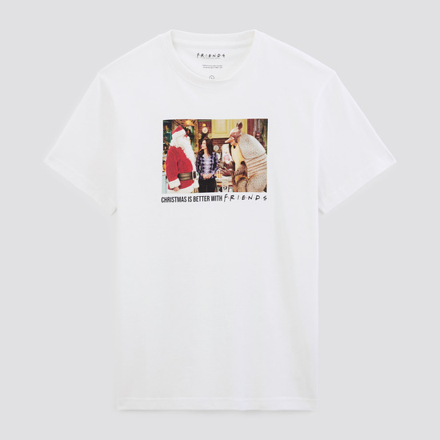

# Flux1-Shnell-LoRA-JLSCOM

This repository is for training the `Flux1.0-Schnell` model using a sample dataset of garments from Jules.com.

This model is licensed under the `AGPL-3.0 License`.  
**Commercial use** of the code, configurations, or model adapters is strictly prohibited without explicit written authorization.

The model weights are hosted on [Hugging Face Hub](https://huggingface.co/) at `Amine-CV/JLSCOM_garment_LoRA_flux_schnell_v1` and are distributed under the `AGPL-3.0 License`.

---

## Inference and Image Generation

To generate images using the model adapters, use the following code and replace `[trigger]` with `JLSCOM`:  

```python
from diffusers import AutoPipelineForText2Image
import torch

pipeline = AutoPipelineForText2Image.from_pretrained(
    'black-forest-labs/FLUX.1-schnell', 
    torch_dtype=torch.bfloat16
).to('cuda')

pipeline.load_lora_weights(
    'Amine-CV/JLSCOM_garment_LoRA_flux_schnell_v1', 
    weight_name='JLSCOM_garment_LoRA_flux_schnell.safetensors'
)

prompt = "[trigger] Garment Type: Slim-Fit Jeans Fit and Style: Slim-fit, designed to hug the legs closely without being overly tight, offering a contemporary, streamlined appearance. ..."
image = pipeline(prompt).images[0]
image.save("my_image.png")
```

### Trigger Word
Use **`JLSCOM`** to activate the image generation style.

---

## Training

This model was trained using the [AI Toolkit by Ostris](https://github.com/ostris/ai-toolkit).  
All training code is included in this repository.

### Cloning the Repository

To clone the repository, use the following command:
```shell
git clone https://github.com/kmamine/Flux1-Shnell-LoRA-JLSCOM.git
```

### Setting Up the Environment

Install the environment using the provided `.yml` file:
```shell
cd ./Flux1-Shnell-LoRA-JLSCOM/
conda env create -f env.yml
```

---

## Dataset Preparation

The training dataset consists of 100 unlabeled garment images from [Jules.com](https://jules.com).

<table>
    <tr>
        <td>  </td>
        <td>  </td>
        <td>  </td>
        <td>  </td>
    </tr>
</table>

### Captioning

Captions were generated using the `OpenAI GPT-4-vision` model. Below is an example script for generating captions:

```python
import openai

openai.api_key = "your_openai_api_key"
image_path = "path/to/your/image.jpg"
caption_path = image_path.replace('jpg', 'txt')

with open(image_path, "rb") as image_file:
    response = openai.ChatCompletion.create(
        model="gpt-4-vision",
        messages=[
            {"role": "system", "content": "You are an AI that captions images."},
            {"role": "user", "content": "Please caption this image."}
        ],
        files={"file": image_file}
    )

caption = "JLSCOM " + response["choices"][0]["message"]["content"].strip()
with open(caption_path, "w") as text_file:
    text_file.write(caption)
```

Ensure your dataset is structured as follows:

```plaintext
dataset/
 ├── img0.jpg
 ├── img0.txt
 ├── img1.jpg
 ├── img1.txt
 ...
```

---

## Training Configuration

The model is trained using `ai-toolkit`. Copy the configuration file to the toolkit's `config` directory:

```shell
cp train_lora_flux_schnell_24gb_JLSCOM.yaml ai-toolkit/config
```

### Key Parameters in Configuration File

#### Output Directory
Specify where weights and outputs will be saved:
```yaml
training_folder: "path/to/output/training/folder"
```

#### Trigger Word
Specify the trigger word for generating the specific style:
```yaml
trigger_word: "JLSCOM"
```

#### LoRA Configuration
Set LoRA fine-tuning parameters:
```yaml
network:
  type: "lora"
  linear: 32
  linear_alpha: 32
```

#### Saving Model Weights
Control checkpoint saving and Hugging Face integration:
```yaml
save:
  dtype: float16
  save_every: 50
  max_step_saves_to_keep: 20
  push_to_hub: true
  hf_repo_id: "Amine-CV/JLSCOM_garment_LoRA_flux_schnell_v1"
```

#### Dataset Configuration
Specify dataset location and file types:
```yaml
datasets:
  folder_path: "../imgs"
  caption_ext: "txt"
```

#### Model Setup
Details for the base model and LoRA adapter:
```yaml
model:
  name_or_path: "black-forest-labs/FLUX.1-schnell"
  assistant_lora_path: "ostris/FLUX.1-schnell-training-adapter"
  quantize: true
  low_vram: true
```

#### Sampling Configuration
Visualize intermediate results during training:
```yaml
sample:
  sampler: "flowmatch"
  sample_every: 50
  width: 1024
  height: 1024
  prompts:
    - "[trigger] holding a sign that says 'I LOVE PROMPTS!'"
```

#### Steps for Sampling
Control the number of steps for generating images:
```yaml
sample_steps: 4
```

---

## Running Training

To start the training process, execute the following command:
```shell
cd ai-toolkit/
python run.py config/train_lora_flux_schnell_24gb_JLSCOM.yaml
```

